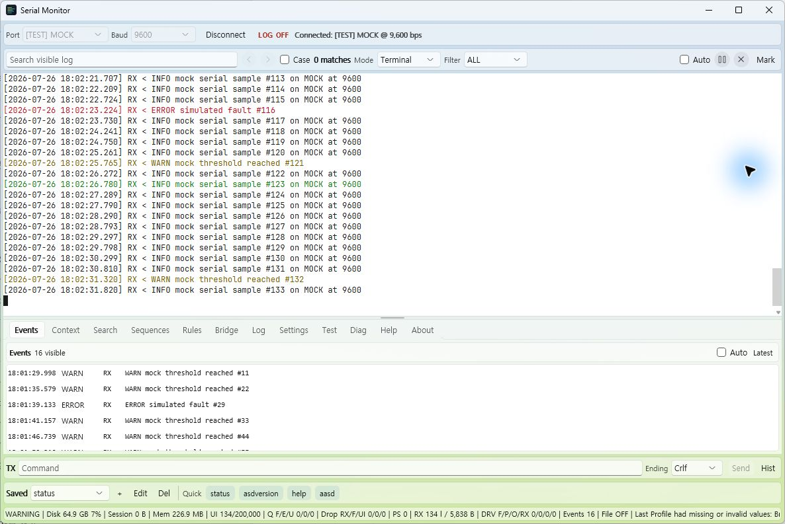
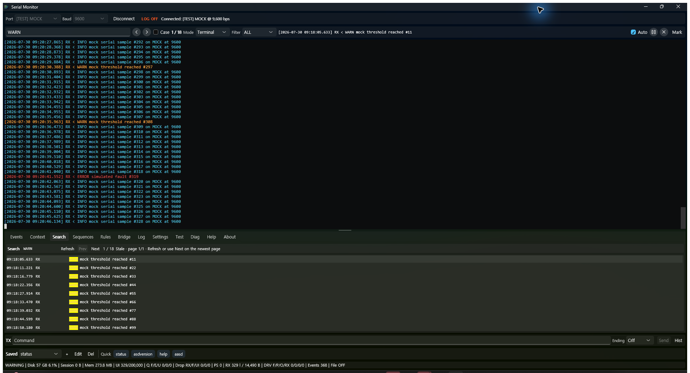

<div align="center">
  
  <h1>Serial Monitor</h1>
  <p><strong>오래 연결해 두어도 버벅이지 않고, 놓친 오류를 다시 찾을 수 있는 Windows 시리얼 모니터</strong></p>
  <p>
    <a href="https://github.com/Establers/custom-serial-monitor/releases/latest"></a>
    
    
    <a href="LICENSE"></a>
  </p>
  <p>
    <a href="https://github.com/Establers/custom-serial-monitor/releases/latest"><strong>최신 버전 다운로드</strong></a>
    ·
    <a href="docs/release_notes_v1.2.4.md">v1.2.4 릴리즈 노트</a>
    ·
    <a href="docs/manual_test_checklist.md">테스트 체크리스트</a>
  </p>
</div>



Serial Monitor는 UART 로그를 몇 분이 아니라 몇 시간, 며칠 동안 관찰하는
임베디드·RTOS 디버깅을 위해 만든 WinUI 3 데스크톱 앱입니다. 화면에는 최근
로그만 제한적으로 유지하고 전체 로그는 별도 작업에서 디스크에 기록합니다.
수신, 파싱, 파일 기록, 이벤트 탐지, UI 표시를 분리해 빠른 데이터가 계속 들어와도
UI 응답성과 메모리 사용량을 예측 가능하게 유지하는 것이 핵심입니다.

## 핵심 사용 흐름

1. COM 포트와 baud rate를 선택해 연결합니다.
2. Terminal 또는 HEX 모드로 RX/TX 데이터를 확인합니다.
3. 필요한 세션은 `LOG ON`으로 전체 기록을 남깁니다.
4. `WARN`, `ERROR`, 재부팅 문자열 같은 규칙을 등록해 이벤트와 전후 문맥을
   자동으로 모읍니다.
5. 검색 결과, 사용자 마커, 진단 카운터로 문제가 발생한 시점을 좁힙니다.
6. 저장 명령과 시퀀스로 같은 재현 절차를 반복합니다.

## 왜 장시간 디버깅에 적합한가요?

- **화면 메모리가 계속 자라지 않습니다.** UI 로그와 이벤트는 bounded buffer로
  제한하고, 전체 기록은 일반 텍스트 파일에 비동기로 저장합니다.
- **수신 경로에서 UI나 디스크를 기다리지 않습니다.** background channel과
  queue가 컴포넌트를 분리하며, 과부하는 drop/error 카운터로 드러납니다.
- **오류 한 줄만 남기지 않습니다.** 키워드 규칙이 일치한 시점의 앞뒤 문맥까지
  함께 캡처해 재현 전후 상태를 확인할 수 있습니다.
- **백그라운드 실패를 숨기지 않습니다.** 파일, 파이프라인, bridge 오류와 큐
  상태를 UI 및 진단 정보에서 확인할 수 있습니다.
- **반복 작업을 프로필로 재사용합니다.** 포트 설정, 룰, 하이라이트, 저장 명령,
  명령 시퀀스를 JSON 프로필로 저장하고 다시 불러올 수 있습니다.

## 5분 안에 시작하기

### 1. 설치

[Releases](https://github.com/Establers/custom-serial-monitor/releases/latest)에서
다음 중 하나를 받습니다.

- `SerialMonitorSetup_*.exe`: 일반 설치 버전
- `SerialMonitorPortable_*.zip`: 설치와 관리자 권한이 필요 없는 포터블 버전

포터블 버전은 ZIP 전체를 푼 뒤 `SerialMonitor.WinUI.exe`를 실행하세요. EXE만
따로 옮기거나 ZIP 안에서 바로 실행하면 안 됩니다.

> Windows 10/11 x64용입니다. xterm 로그 화면에는 Microsoft Edge WebView2
> Runtime이 필요합니다. 설치 파일은 현재 코드 서명이 없어 SmartScreen에서
> 알 수 없는 게시자 경고가 표시될 수 있습니다.

### 2. 장치 연결

상단의 `Port`와 `Baud`를 선택하고 `Connect`를 누릅니다. 데이터 형식과 줄 끝,
encoding, Terminal/HEX 모드는 `Settings`에서 조정할 수 있습니다.

### 3. 장치 없이 둘러보기

Debug 빌드에서는 `Test` 탭의 `Show MOCK test port`를 켠 뒤 `[TEST] MOCK`에
연결할 수 있습니다. 일반 로그, WARN/ERROR 주입, burst와 stress 동작을 실제
파이프라인으로 확인할 때 사용합니다. 배포용 Release 빌드에서는 MOCK 포트가
표시되지 않습니다.

### 4. 전체 로그 저장

`Log` 탭에서 저장 폴더, 파일 이름, 회전 크기를 정한 뒤 `LOG ON`을 누릅니다.
HEX 모드의 수신 데이터는 byte-exact 16진수 텍스트로 기록되며 raw `.bin` 기록은
제공하지 않습니다.

## 주요 기능

| 영역 | 제공 기능 |
| --- | --- |
| RX 표시 | 실제 COM 포트, Terminal/HEX 모드, UTF 계열·코드 페이지 디코딩, timestamp와 RX/TX prefix |
| 연결 복구 | 실제 COM의 예기치 않은 읽기/쓰기 실패 후 같은 포트 자동 재연결, 1·2·5·10초 backoff, 수동 취소 |
| 대용량 화면 | xterm.js 기반 선택·복사, batched append, bounded UI log buffer, pause/auto-scroll |
| 파일 기록 | 비동기 plain-text 기록, 크기 기반 회전, 사용자 파일 이름, flush/error 카운터 |
| 이벤트 | Terminal/HEX 전용 규칙, 전후 문맥, 일치 문자열 강조, 트레이 알림 |
| 검색 | 현재 보관 중인 로그 검색, F3/Shift+F3, 결과 목록, 1,000줄 단위 페이지 |
| TX | 수동 전송, 줄 끝 설정, 저장 명령, quick button, 명령 history, 사용자 marker |
| 자동화 | 지연 시간을 포함한 명령 시퀀스, 1~99회 반복, RX 룰 기반 안전한 1회 트리거 |
| 프로필 | 설정·룰·명령·시퀀스 JSON 저장/불러오기/초기화, 이전 형식 정규화 |
| Bridge | 물리 COM과 가상 COM 사이의 선택적 양방향 raw-byte 전달 및 별도 진단 |
| 진단 | 큐/drop/error 카운터, 상태 요약, 복사 가능한 진단 정보, HEX RX BUSY/IDLE 추정 |

## 검색과 이벤트 검토



상단 검색은 현재 화면 메모리에 보관된 로그 snapshot을 대상으로 합니다. 결과는
시간, 방향, 메시지로 나뉘며 행을 더블 클릭하면 원본 로그 위치로 이동합니다.
같은 줄의 반복 일치는 한 행으로 묶고, 일치 로그가 많으면 1,000줄 단위로
페이지를 이동합니다.

로그가 계속 들어오는 동안 선택이 흔들리지 않도록 결과 목록은 수동 새로고침이
기본입니다. 새 로그를 포함하려면 `Enter`, `Refresh`, 또는 최신 페이지의 `Next`를
사용하세요. 디스크에 기록된 전체 로그 검색은 현재 외부 텍스트 도구가 필요합니다.

## 안정성을 위한 구조

```text
Serial RX
  -> bounded byte channel
  -> framing / decoding / timestamp
  -> bounded LogLine channel
       -> batched, bounded UI renderer
       -> asynchronous file writer
       -> event detector + context capture
```

serial receive callback은 UI control을 갱신하거나 파일을 쓰지 않습니다. 각
background worker는 cancellation을 지원하고, 비정상 종료를 잡아 UI에 노출합니다.
종료 시에는 producer를 먼저 멈추고 writer가 제한된 시간 안에 drain·flush하도록
정리합니다. 자세한 설계는 [아키텍처 문서](docs/architecture.md)를 참고하세요.

## 알아둘 제한 사항

- 화면 검색은 디스크 전체가 아니라 현재 retained UI buffer만 대상으로 합니다.
- 이벤트 탐지는 keyword/rule 기반이며 Terminal 룰과 HEX 룰은 서로 다른 모드에서
  동작합니다.
- command sequence는 고정 명령과 지연을 순서대로 실행합니다. 응답 분기와
  parameter template은 아직 제공하지 않습니다.
- 자동 재연결은 같은 COM 포트 이름을 다시 엽니다. 장치 고유 ID를 따라 COM
  번호 변경을 추적하지 않으며, 중단된 bridge나 command sequence를 자동으로
  다시 시작하지 않습니다.
- COM bridge는 byte를 그대로 전달하지만 modem-control line과 BREAK를 전달하지
  않으며, com0com 같은 가상 포트 드라이버는 별도로 준비해야 합니다.
- MOCK/stress 검증은 실제 USB-UART adapter와 장치의 장시간 검증을 대체하지
  않습니다.

전체 목록은 [Known Limitations](docs/known_limitations.md)에서 관리합니다.

## 개발 및 빌드

요구 사항은 Windows 10/11 x64, .NET 8 SDK, Visual Studio 2022 또는 동등한
MSBuild 환경입니다.

```powershell
dotnet build SerialMonitor.WinUI\SerialMonitor.WinUI.sln -c Debug
dotnet build SerialMonitor.WinUI\SerialMonitor.WinUI.sln -c Release
dotnet test SerialMonitor.WinUI\SerialMonitor.WinUI.sln -c Debug
```

포터블 ZIP과 선택적 Inno Setup 설치 파일은 저장소 루트에서 만듭니다.

```powershell
powershell -ExecutionPolicy Bypass -File scripts\publish_portable.ps1
powershell -ExecutionPolicy Bypass -File scripts\build_installer.ps1
```

출력은 `release` 폴더에 생성되며 MSIX/AppX 패키지는 사용하지 않습니다.
자세한 절차는 [포터블 배포](docs/portable_deployment.md)와
[설치 파일 배포](docs/installer_deployment.md)를 참고하세요.

## 데이터 위치

| 데이터 | 기본 위치 |
| --- | --- |
| 시리얼 로그 | `%LOCALAPPDATA%\SerialMonitor\logs` |
| 기본 프로필 | `%LOCALAPPDATA%\SerialMonitor\profiles\default.json` |
| 마지막 런타임 오류 | `%LOCALAPPDATA%\SerialMonitor\diagnostics\last_runtime_error.txt` |

## 문서

- [요구 사항](docs/requirements.md)
- [아키텍처](docs/architecture.md)
- [로깅 동작](docs/logging.md)
- [수동 회귀 테스트](docs/manual_test_checklist.md)
- [com0com 스트레스 테스트](docs/com0com_stress_testing.md)
- [HEX RX 버스 사용량 계산](docs/bus_utilization.md)
- [v1.2.4 릴리즈 노트](docs/release_notes_v1.2.4.md)

## 라이선스

[MIT License](LICENSE)로 배포됩니다. 포함된 JetBrains Mono 글꼴은
`SerialMonitor.WinUI/Assets/xterm/fonts/OFL.txt`의 SIL Open Font License를
따릅니다.
